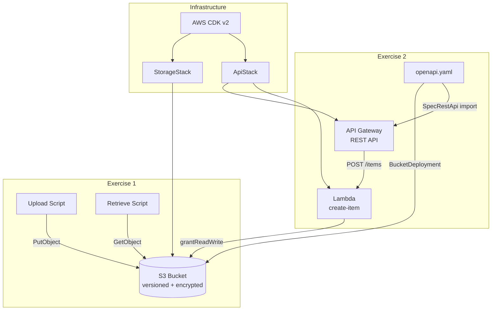

# Backend Developer Test

Production-grade AWS serverless project demonstrating S3 file operations and an OpenAPI-driven API Gateway + Lambda pipeline, fully defined as Infrastructure as Code with AWS CDK and runnable locally via LocalStack.

## Architecture



## Prerequisites

| Tool | Version | Install |
|------|---------|---------|
| Node.js | 20.x+ | [nodejs.org](https://nodejs.org) |
| Docker | Latest | [docker.com](https://www.docker.com) |
| AWS CDK | 2.x | `npm install -g aws-cdk` |
| cdklocal | Latest | `npm install -g aws-cdk-local` |
| awslocal | Latest | `pip install awscli-local` |

## Quick Start

```bash
# 1. Install dependencies
npm install

# 2. Start LocalStack
npm run local:up

# 3. Deploy CDK stacks to LocalStack
npm run local:deploy

# 4. Run Exercise 1 — upload & retrieve
npm run upload
npm run retrieve

# 5. Run Exercise 2 — call the API
# Get the API Gateway ID first:
awslocal apigateway get-rest-apis --query 'items[0].id' --output text
# Then call the POST endpoint (replace <api-id>):
curl -X POST http://localhost:4566/restapis/<api-id>/local/_user_request_/items \
  -H 'Content-Type: application/json' \
  -d '{"name": "My Item", "description": "Created via API"}'
```

## Exercise 1: S3 Upload & Retrieve

### Upload a JSON file

```bash
# Upload the default sample file
npm run upload

# Upload a specific file with a custom key
npm run upload -- path/to/file.json my-folder/my-key.json
```

### Retrieve a JSON file

```bash
# Retrieve the default key
npm run retrieve

# Retrieve a specific key
npm run retrieve -- my-folder/my-key.json
```

### Error handling

Both scripts handle these scenarios with structured error output:
- **NoSuchBucket** — bucket doesn't exist
- **NoSuchKey** — object key not found
- **AccessDenied** — insufficient IAM permissions
- **Invalid JSON** — file content is not valid JSON
- **Network/throttle errors** — classified as retryable

## Exercise 2: API Gateway POST Endpoint

The OpenAPI spec (`api/openapi.yaml`) is the single source of truth. It's uploaded to S3 and imported into API Gateway via `SpecRestApi`.

### Create an item

```bash
curl -X POST http://localhost:4566/restapis/<api-id>/local/_user_request_/items \
  -H 'Content-Type: application/json' \
  -d '{"name": "Widget", "description": "A useful widget"}'
```

**201 Response:**
```json
{
  "id": "550e8400-e29b-41d4-a716-446655440000",
  "name": "Widget",
  "description": "A useful widget",
  "createdAt": "2026-02-15T10:30:00.000Z"
}
```

**400 Response (validation error):**
```json
{
  "error": "VALIDATION_ERROR",
  "message": "name is required and must be a non-empty string",
  "requestId": "abc-123"
}
```

## IAM Permissions

| Principal | Permission | Resource | Why |
|-----------|-----------|----------|-----|
| `create-item` Lambda | `s3:GetObject`, `s3:PutObject`, `s3:DeleteObject`, `s3:GetBucket*` | Storage bucket + objects | Read/write items to S3. Granted via `bucket.grantReadWrite(fn)` which generates a scoped policy. |
| API Gateway | `lambda:InvokeFunction` | `create-item` Lambda ARN | API Gateway needs permission to invoke the Lambda on incoming HTTP requests. Scoped to this API's execution ARN. |
| Lambda execution role | `logs:CreateLogGroup`, `logs:CreateLogStream`, `logs:PutLogEvents` | CloudWatch Logs | Auto-granted by CDK's `NodejsFunction`. Enables structured logging. |
| Lambda execution role | `xray:PutTraceSegments`, `xray:PutTelemetryRecords` | `*` | Auto-granted when `tracing: ACTIVE`. Enables X-Ray distributed tracing. |

All IAM policies are generated by CDK grants — no raw policy JSON in the codebase.

## Testing

```bash
# Unit tests (mocked AWS SDK)
npm run test

# Unit tests with coverage report
npm run test:coverage

# Integration tests (requires LocalStack running)
npm run test:int
```

### Test structure

```
test/
├── setup.ts                              # Global test setup
├── helpers/
│   └── api-gateway-event.ts              # API Gateway event factory
├── unit/
│   ├── handlers/
│   │   └── create-item.test.ts           # Lambda handler tests
│   └── lib/
│       ├── errors.test.ts                # Error classification tests
│       └── s3-client.test.ts             # S3 client factory tests
└── integration/
    ├── setup.ts                          # LocalStack client + bucket setup
    └── s3-upload-retrieve.test.ts        # End-to-end S3 operations
```

## Cleanup

```bash
# Tear down CDK stacks
npm run local:destroy

# Stop LocalStack
npm run local:down

# Full reset (stop, clear volumes, restart, redeploy)
npm run local:reset
```

## Project Structure

```
├── bin/app.ts                        # CDK app entry point
├── lib/
│   ├── stacks/
│   │   ├── storage-stack.ts          # S3 bucket (versioned, encrypted)
│   │   └── api-stack.ts              # API Gateway + Lambda + OpenAPI import
│   └── constructs/
│       └── lambda-function.ts        # Reusable Lambda construct
├── src/
│   ├── handlers/create-item.ts       # Lambda: POST /items
│   ├── lib/
│   │   ├── s3-client.ts              # S3 client factory (LocalStack-aware)
│   │   ├── errors.ts                 # Typed error classification
│   │   └── config.ts                 # Environment config loader
│   └── scripts/
│       ├── upload.ts                 # Exercise 1: Upload JSON to S3
│       └── retrieve.ts              # Exercise 1: Retrieve JSON from S3
├── api/openapi.yaml                  # OpenAPI 3.0 spec
├── test/                             # Unit + integration tests
├── docker-compose.yml                # LocalStack container
├── vitest.config.ts                  # Unit test config
├── vitest.integration.config.ts      # Integration test config
└── Makefile                          # Convenience commands
```
